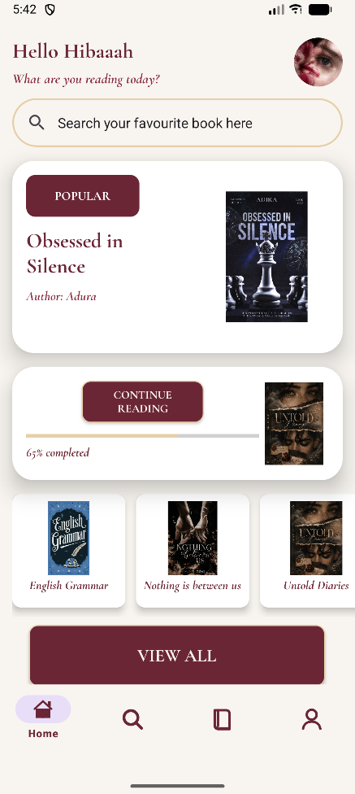
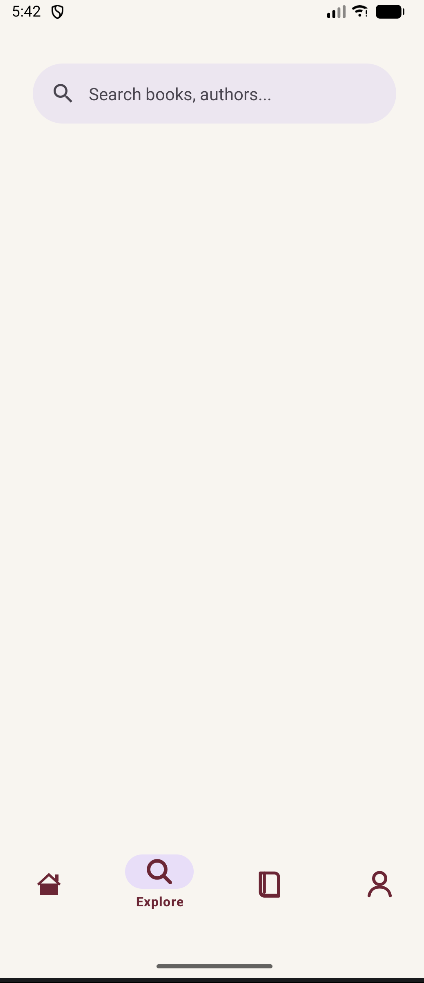
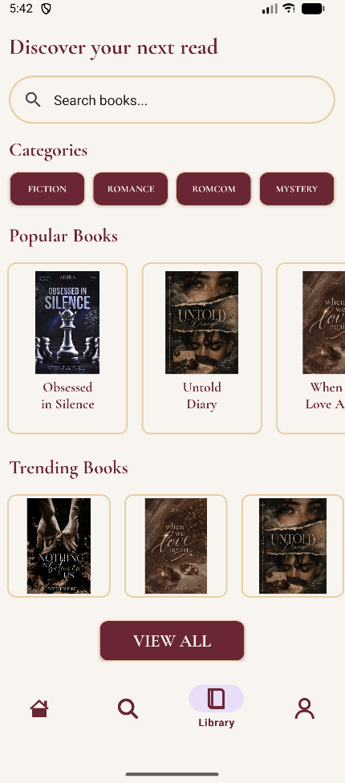
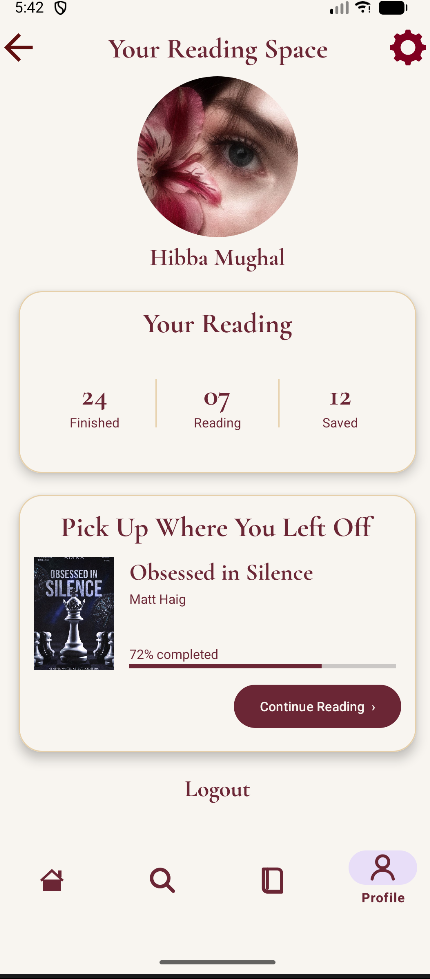
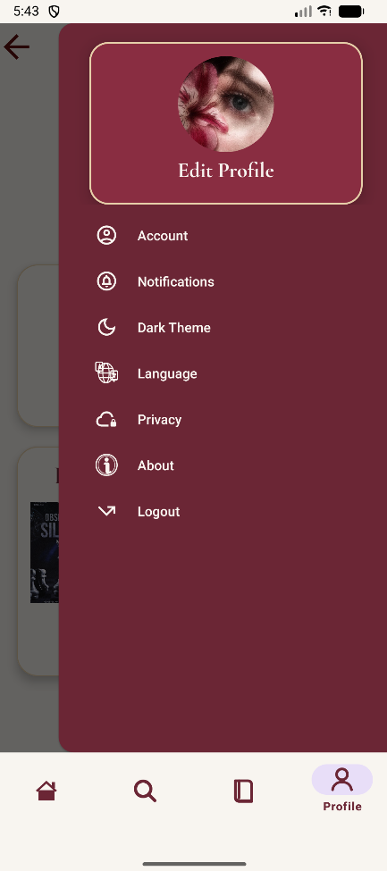

<div align="center">


<h2>Discover. Read. Collect.</h2>

<p>
<b>A refined Android reading experience built with Kotlin and XML.</b>
</p>

<p>
Bookly brings together books, discovery, personal collections, and profile management
inside a warm literary interface inspired by classic book aesthetics.
</p>

<br/>


<br/><br/>


<br/>


</div>

---

# Bookly

> **A quiet place for books, discovery, and everything worth reading.**

Bookly is a **UI-focused Android application** designed around the experience of discovering and organizing books.

The interface combines a rich **burgundy palette**, warm cream surfaces, elegant typography, custom resources, and carefully structured layouts to create an application that feels more like a digital reading space than a conventional mobile interface.

The current project focuses on the **frontend experience and navigation structure**, built entirely with Kotlin and XML.

---

# The Experience

<div align="center">

|             Discover            |                Explore                |                Collect               |            Personalize           |
| :-----------------------------: | :-----------------------------------: | :----------------------------------: | :------------------------------: |
| Find books and featured content | Browse categories and recommendations | Keep your personal library organized | Manage your profile and settings |

</div>

Bookly is structured around four primary areas:

**Home**
A welcoming starting point with featured books and quick access to content.

**Explore**
A discovery-focused space for categories, recommendations, and horizontally scrollable sections.

**Library**
A dedicated space for a user's saved and collected books.

**Profile**
A personal area containing profile information and access to the settings side navigation.

---

# Screens

<div align="center">

<table>
<tr>

<td align="center" width="33%">

**Splash Screen**

<br/>


</td>

<td align="center" width="33%">

**Login Screen**

<br/>


</td>

<td align="center" width="33%">

**Home Screen**

<br/>



</td>

</tr>

<tr>

<td align="center" width="33%">

**Explore Screen**

<br/>



</td>

<td align="center" width="33%">

**Library Screen**

<br/>



</td>

<td align="center" width="33%">

**Profile Screen**

<br/>



</td>

</tr>

<tr>

<td align="center" width="33%">

**Profile Settings**

<br/>



</td>

<td></td>
<td></td>

</tr>
</table>

</div>

---

# Navigation

Bookly keeps the main application flow simple and centralized.

```text
                         Splash Screen
                               │
                               ▼
                         Login Screen
                               │
                               ▼
                        MainActivity3
                               │
              ┌────────────────┼────────────────┐
              │                │                │
              ▼                ▼                ▼
           Home            Explore           Library
              │                │                │
              └────────────────┼────────────────┘
                               │
                               ▼
                           Profile
                               │
                               ▼
                    Settings Side Navigation
```

`MainActivity3` acts as the main host for the application's primary fragments.

---

# Visual Language

## Burgundy & Cream

The entire interface is built around a restrained literary palette.

<div align="center">

<table>
<tr>
<td align="center" width="20%">


<br/>

**Burgundy**

<br/>

`#800020`

</td>

<td align="center" width="20%">


<br/>

**Cream**

<br/>

`#FFF8E7`

</td>

<td align="center" width="20%">


<br/>

**Rose Burgundy**

<br/>

`#A9384D`

</td>

<td align="center" width="20%">


<br/>

**Deep Wine**

<br/>

`#4A0E1F`

</td>

<td align="center" width="20%">


<br/>

**Warm Sand**

<br/>

`#EFE3C8`

</td>
</tr>
</table>

</div>

### Color Roles

| Color     | Role                                                 |
| :-------- | :--------------------------------------------------- |
| `#800020` | Primary brand color, buttons, icons, active states   |
| `#FFF8E7` | Main background, cards, and light surfaces           |
| `#A9384D` | Secondary burgundy and interactive states            |
| `#4A0E1F` | Deep accents and darker typography                   |
| `#EFE3C8` | Supporting surfaces, separators, and subtle contrast |

The palette intentionally keeps the interface warm rather than relying on the typical blue, green, or purple Android color systems.

---

# Typography

Typography is one of the defining elements of Bookly.

Instead of treating text as simple UI labels, the design uses typography to reinforce the application's **literary identity**.

<div align="center">

### Cormorant Garamond

**The literary voice of Bookly**

*Elegant serif forms create the feeling of a classic book cover while keeping headings distinctive and expressive.*

<br/>

### Clean Supporting Typography

**The functional voice of Bookly**

Used for supporting information, controls, navigation labels, and content where clarity is more important than decoration.

</div>

The combination creates a deliberate contrast:

```text
LITERARY
Elegant
Expressive
Classic
Distinctive

        +

FUNCTIONAL
Clean
Readable
Structured
Modern
```

This balance allows Bookly to feel **book-inspired without becoming visually outdated**.

---

# UI Details

Bookly's visual system is built around consistency rather than excessive decoration.

### Cards

Book cards and content surfaces use:

* Soft cream surfaces
* Burgundy accents
* Controlled corner radii
* Consistent internal spacing
* Clear hierarchy between title, author, and supporting content

### Buttons

Primary actions follow the Burgundy and Cream identity with clear visual hierarchy and consistent sizing.

### Navigation

The bottom navigation provides access to:

```text
Home       Explore       Library       Profile
```

The profile screen additionally provides access to the settings side navigation.

### Spacing

Dimensions are centralized through Android resource files, allowing spacing, sizing, and typography values to remain consistent throughout the application.

---

# Tech Stack

<div align="center">

| Layer                   | Technology                                |
| :---------------------- | :---------------------------------------- |
| Language                | **Kotlin**                                |
| UI Development          | **XML**                                   |
| Platform                | **Android**                               |
| UI Components           | **Material Design / Material Components** |
| Navigation              | **Android Fragments**                     |
| Build System            | **Gradle**                                |
| Development Environment | **Android Studio**                        |
| Version Control         | **Git & GitHub**                          |
| Minimum SDK             | **API 24**                                |
| Compile SDK             | **API 37**                                |

</div>

---

# Architecture

The application uses a straightforward Activity + Fragment architecture.

```text
MainActivity
     │
     └── Initial application flow
              │
              ▼
        MainActivity3
              │
       ┌──────┼──────┬─────────┐
       │      │      │         │
       ▼      ▼      ▼         ▼
     Home  Explore Library   Profile
                              │
                              ▼
                       Settings Navigation
```

The main fragments remain under `MainActivity3`, keeping the primary navigation flow centralized.

---

# Project Structure

The project is organized according to the Android Studio structure currently used by Bookly.

```text
Bookly/
│
├── app/
│   │
│   ├── androidTest/
│   │
│   ├── main/
│   │
│   ├── unitTest/
│   │
│   ├── manifests/
│   │
│   ├── kotlin+java/
│   │   └── com.hibba.bookly/
│   │       │
│   │       ├── MainActivity.kt
│   │       ├── MainActivity3.kt
│   │       │
│   │       ├── HomeFragment.kt
│   │       ├── ExploreFragment.kt
│   │       ├── LibraryFragment.kt
│   │       └── ProfileFragment.kt
│   │
│   ├── res/
│   │   │
│   │   ├── drawable/
│   │   ├── font/
│   │   ├── layout/
│   │   ├── menu/
│   │   ├── mipmap/
│   │   ├── values/
│   │   └── xml/
│   │
│   └── keepRules/
│
├── ScreenShots/
│   ├── SplashScreen.png
│   ├── LoginScreen.png
│   ├── HomeScreen.png
│   ├── ExploreScreen.png
│   ├── LibraryScreen.png
│   ├── ProfileScreen.png
│   └── ProfileSideNavigationSetting.png
│
├── build.gradle.kts
├── settings.gradle.kts
├── gradle.properties
├── .gitignore
└── README.md
```

### Kotlin

```text
kotlin+java/
└── com.hibba.bookly/
    │
    ├── MainActivity.kt
    ├── MainActivity3.kt
    │
    ├── HomeFragment.kt
    ├── ExploreFragment.kt
    ├── LibraryFragment.kt
    └── ProfileFragment.kt
```

### Resources

```text
res/
│
├── drawable/     → backgrounds, shapes, icons and visual resources
├── font/         → custom typography
├── layout/       → XML screen layouts
├── menu/         → navigation and menu resources
├── mipmap/       → launcher resources
├── values/       → colors, strings, dimensions, themes and styles
└── xml/          → additional XML configuration
```

---

# Getting Started

## Clone

```bash
git clone https://github.com/h-hibaaah/Bookly.git
```

## Open

Open the cloned project in **Android Studio**:

```text
File → Open → Bookly
```

## Sync

Allow Android Studio to complete the Gradle synchronization.

## Run

Start an Android emulator or connect an Android device, then run the application.

---

# Requirements

| Requirement | Version        |
| :---------- | :------------- |
| Platform    | Android        |
| Minimum SDK | API 24         |
| Compile SDK | API 37         |
| Language    | Kotlin         |
| UI          | XML            |
| IDE         | Android Studio |

---

# Repository

<div align="center">

<a href="https://github.com/h-hibaaah/Bookly">


</a>

<br/><br/>


<h2>Bookly</h2>

<p><i>Every great story starts with a single page.</i></p>

</div>
